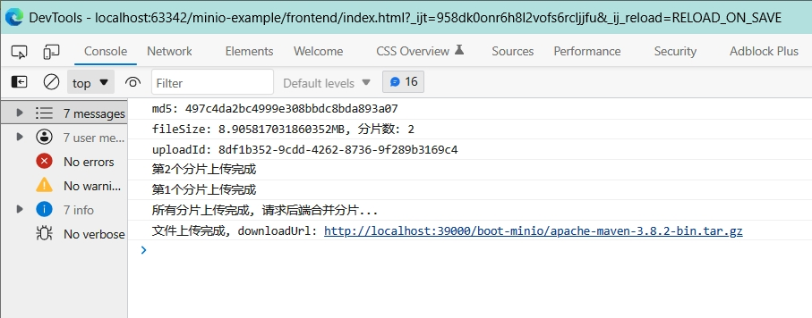
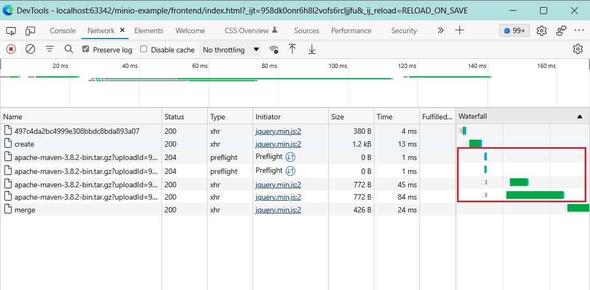
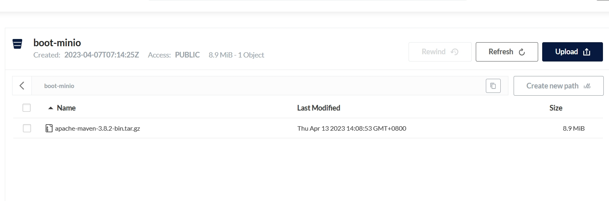
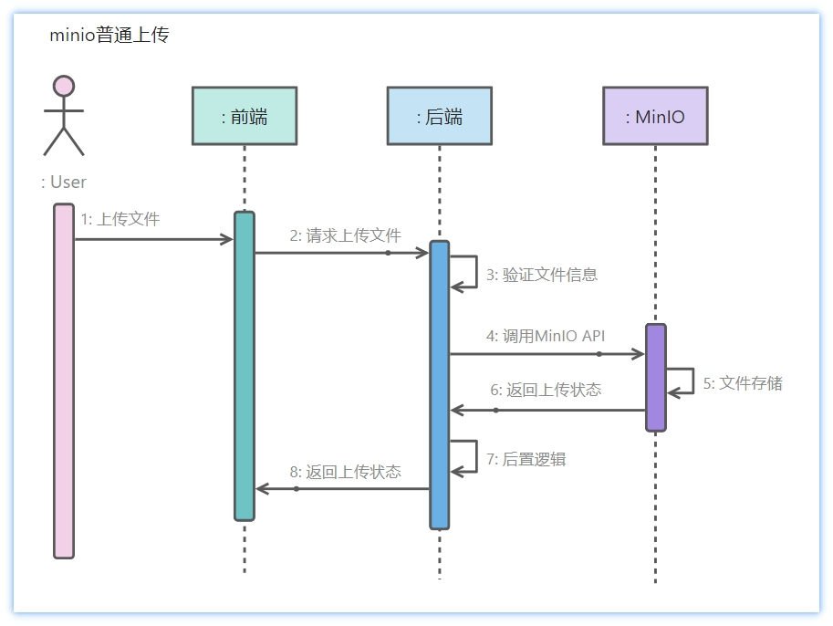
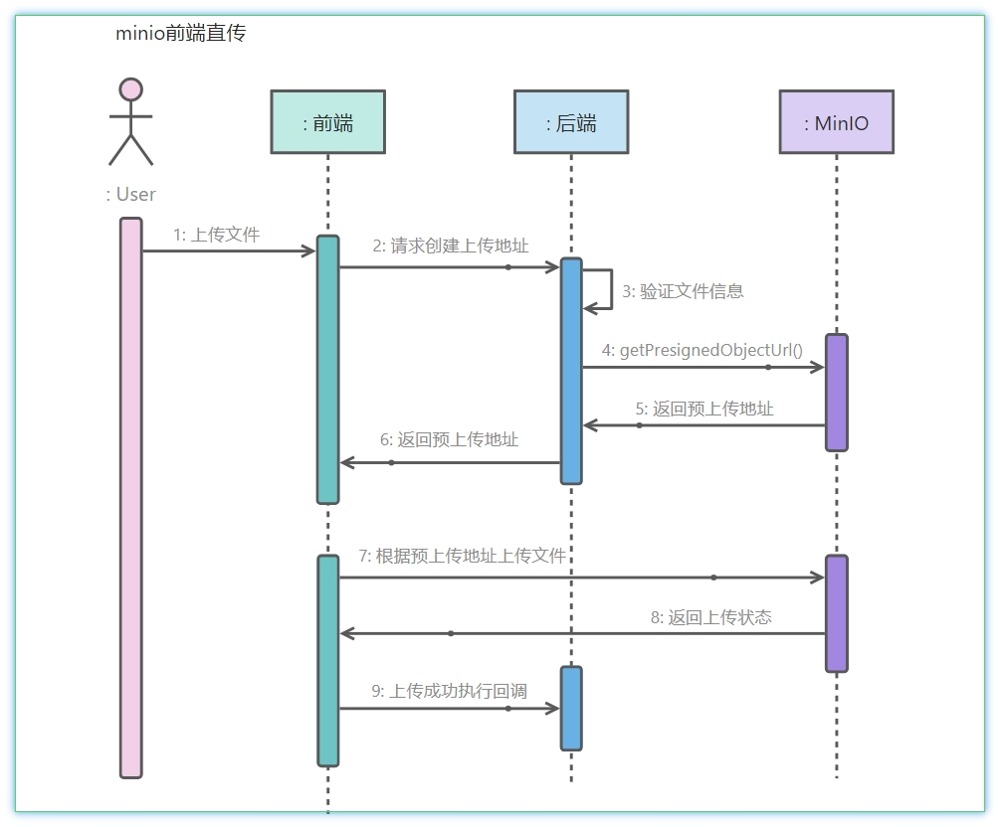
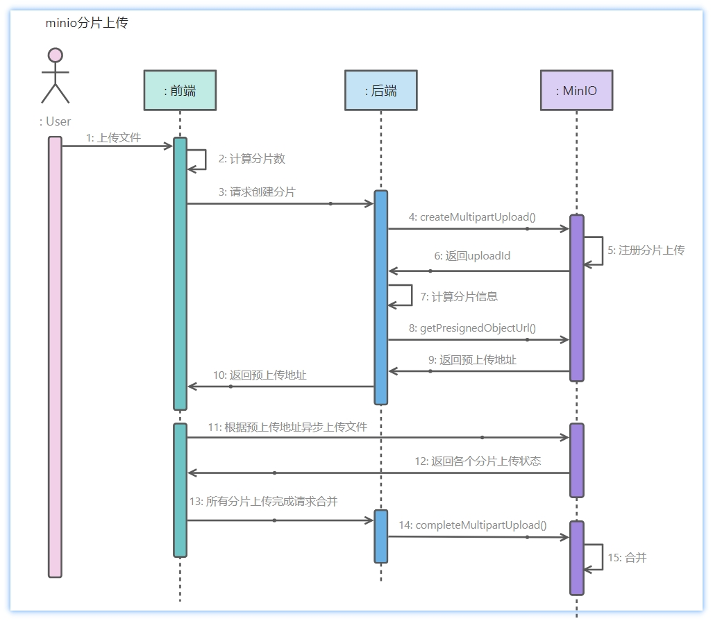

# 操作手册

1. 建好桶、生成AccessKey/AccessSecret  
2. 运行后端
3. 运行frontend/index.html
4. F12打开前端控制台
5. 上传文件查看前端Console和后端日志








## 普通上传



上传文件由后端完成。  
优点: 逻辑简单，后端方便控制流程。  
缺点: 整个流程同步，文件流要先送到后端，后端再送给 minio。

## 前端直连minio上传



上传文件由前端完成。  
优点: 文件流可以不通过后端，直传 minio。  
缺点: 上传流程复杂，前端先请求后端 MinIO API，获取预上传地址，前端再根据预上传地址进行文件上传。

因为上传不通过后端，中途可能上传失败，所以上传成功后应该告诉后端文件已经上传成功。

## 分片上传



分片上传为前端直传 minio，将一个文件切分成多块儿，分别上传。  
优点: 上传分片可异步，适合大型文件，直传 minio 效率高。  
缺点: 实现复杂，不适合小文件。  

流程: 前端请求后端获取分片信息，获得 minio 生成的预上传地址，前端再将文件分片，发起异步请求向 minio 上传文件。  
所有分片上传完成后需要执行合并操作，合并完成后上传的文件才能在 minio 可见，无法看见上传的分片。  

可通过 API listParts，根据 uploadId 和 objectName 查询已上传的分片。

## 断点续传

每一次调用创建分片 API 都会注册一个新的 uploadId，所以一个文件反复上传不会触发断点续传。如需要断点续传则要设计一个保存uploadId的机制(example暂未实现)。

另外还需要考虑到分片保存的时间  
```java
customizedMinioClient.getPresignedObjectUrl(
    GetPresignedObjectUrlArgs.builder()
        .method(Method.PUT)
        .bucket(params.getBucketName())
        .object(params.getObjectName())
        .expiry(1, TimeUnit.DAYS)
        .extraQueryParams(queryParams)
        .build()
);
```

## 秒传

数据库保存上传文件的 md5 值和文件的上传路径。  
如果文件的 md5 值存在则直接返回 minio 的文件路径，如果不存在则走上传逻辑。  

更严谨一点，如果md5存在并且minio中也有这个文件时再返回地址。

## - 踩坑

partNumber 基于 0 产生的问题  
由于 partNumber 是 minio 产生分片时自定义传入的参数，完全可以从任何数开始自定义 partNumber

```java
// 根据前端的分片数量生成分片的上传地址
Map<String, String> queryParams = new HashMap<>(4);
queryParams.put("uploadId", result.getUploadId());
// 一定要注意partNumber从1开始, 从0开始会丢失0这个分片
for (int i = 1; i <= params.getPartCount(); i++) {
    queryParams.put("partNumber", String.valueOf(i));
    String presignedObjectUrl = getPresignedObjectUrl(minioParams, queryParams);
    // 如果为minio做了Nginx代理, 则使用Nginx代理地址
    if (!StrUtil.isBlank(minioProperties.getEndpointProxy())) {
        presignedObjectUrl = presignedObjectUrl.replace(minioProperties.getEndpoint(), minioProperties.getEndpointProxy());
    }
    CreatePartResult.PartItem item = new CreatePartResult.PartItem();
    item.setPartNumber(i);
    item.setUploadUrl(presignedObjectUrl);
    result.getParts().add(item);
}
```
`partNumberMarker`参数，不传默认为 0，不能传负数，只会查询大于这个参数的 partNumber。  
如果 for 循环是从 0 开始，那么后续查询已上传分片信息时就查询不到 0 这一个分片。

```java
MinioParams minioParams = MinioParams.builder()
    .bucketName(minioProperties.getBucket())
    .uploadId(params.getUploadId())
    .objectName(params.getObjectName())
    // 查询最大分片数, 默认1000
    // .maxParts(params.getPartSize())
    // 指定List的起始位置, 只有Part Number数目大于该参数的Part会被列出
    .partNumberMarker(0)
    .build();
// 查询分片
ListPartsResponse listPartsRes = listParts(minioParams);
// 合并
minioParams.setParts(listPartsRes.result().partList().toArray(new Part[]{}));
doMergePartition(minioParams);
```

如果 listPartsRes.result().partList()查询的信息缺少，那么最终合并的文件就不会完整。  
所以 partNumber 一定要从大于 0 的数开始。
